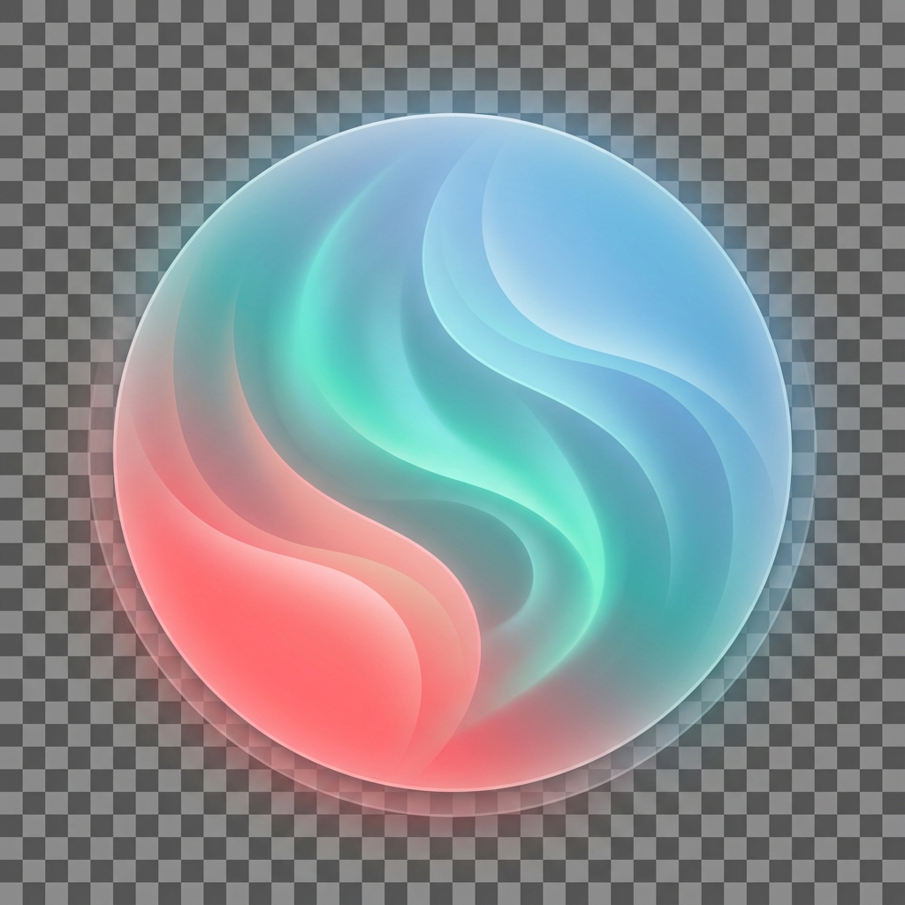

# 🌟 Aura - New Tab Vibes

  

  <strong>Transform every new tab into your personal sanctuary</strong> 
  Stunning colors • Gradients • Weather • Particles • Focus Mode

  <a href="#features">Features</a> •
  <a href="#installation">Installation</a> •
  <a href="#usage">Usage</a> •
  <a href="#screenshots">Screenshots</a>

---

## ✨ Features

### 🎨 **Color Customization**
- **40+ Curated Colors** - Hand-picked palettes in Warm, Cool, Nature, Neutral, and Dark categories
- **Custom Color Picker** - Choose any color with hex input support
- **20+ Stunning Gradients** - Beautiful gradient backgrounds for every mood
- **Favorites System** - Save up to 12 favorite colors/gradients
- **Color History** - Quick access to your last 10 colors

### 🎭 **Theme Presets**
One-click mood presets:
- 🎯 **Focus** - Deep blue for concentration
- 🧘 **Calm** - Soft mint for relaxation
- ⚡ **Energy** - Vibrant coral for motivation
- 🌅 **Sunset** - Warm evening vibes
- 🌙 **Midnight** - Dark mode for night owls
- 🌊 **Ocean** - Cool waves of blue

### 🔍 **Smart Search**
- Integrated search bar on every new tab
- Switch between **Google**, **DuckDuckGo**, and **Bing**
- Quick keyboard focus

### 🌤️ **Live Weather**
- Real-time weather display
- Beautiful weather icons
- Location-based (permission required)
- 30-minute cache for efficiency

### ✨ **Ambient Particles**
- Mesmerizing floating particles effect
- Subtle connecting lines animation
- Toggleable for performance

### 🧘 **Focus Mode**
- Hide all distractions with one click
- Clean, minimalist time display
- Perfect for deep work sessions

### 🔗 **Quick Links**
- Fast access to your favorite sites
- Gmail, YouTube, GitHub, Twitter shortcuts

---

## 📥 Installation

### From Chrome Web Store
*(Coming Soon)*

### Manual Installation (Developer Mode)
1. Download or clone this repository
2. Open Chrome and go to `chrome://extensions/`
3. Enable **Developer mode** (toggle in top right)
4. Click **Load unpacked**
5. Select the `colorflow-extension` folder
6. Enjoy your new Aura experience! 🎉

---

## 🚀 Usage

### Changing Colors
1. Click the Aura icon in your Chrome toolbar
2. Navigate through **Colors**, **Gradients**, or **Presets** tabs
3. Click any color/gradient to apply instantly
4. Use the custom color picker for any specific color

### Managing Favorites
1. Select a color or gradient
2. Click the **+** button in the Favorites section
3. Access your favorites anytime from the Colors tab
4. Remove by hovering and clicking the **×** button

### Toggle Features
- **Particles** - Enable/disable ambient particles
- **Weather** - Show/hide weather widget
- Both toggles are in the popup footer

### Focus Mode
Click the target icon (bottom-right of new tab) to enter distraction-free mode.

---

## 📸 Screenshots

### New Tab Experience
Beautiful, personalized new tab with time, search, and weather.

### Color Picker Popup
Easy-to-use popup with tabs for colors, gradients, and presets.

### Gradient Backgrounds
Stunning gradient options for a premium feel.

### Focus Mode
Clean, minimal display for deep work.

---

## 🛠️ Tech Stack

- **Manifest V3** - Latest Chrome extension format
- **Vanilla JavaScript** - No frameworks, fast and lightweight
- **Modern CSS** - Glassmorphism, animations, responsive design
- **Open-Meteo API** - Free weather data
- **Canvas API** - Particle animations

---

## 📄 Permissions

| Permission | Purpose |
|------------|---------|
| `storage` | Save your color preferences and settings |

**Note:** Location access (requested on-demand) is only used to get local weather data. We don't store or share your location.

---

## 🤝 Contributing

Contributions are welcome! Feel free to:
- 🐛 Report bugs
- 💡 Suggest features
- 🔧 Submit pull requests

---

## 📝 License

MIT License - feel free to use and modify as you wish!

---

## 💖 Support

If you enjoy Aura, please:
- ⭐ Star this repository
- 📢 Share with friends
- 📝 Leave a review on the Chrome Web Store

---

  Made with ❤️ for a more colorful browsing experience

